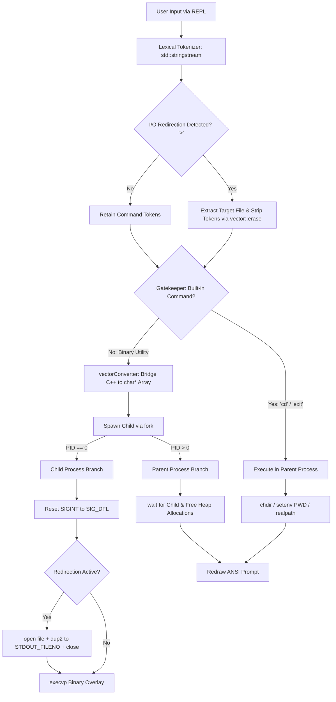
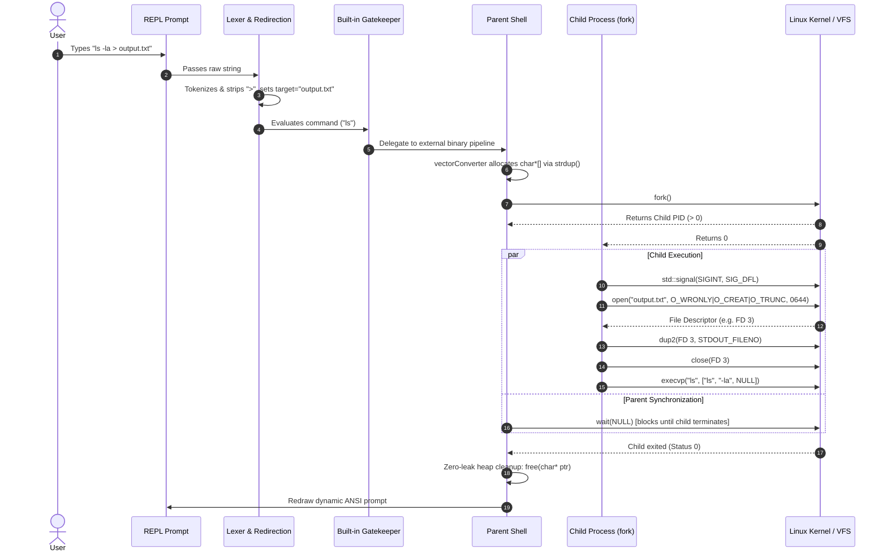

# 🚀 NovaShell

<p align="center">
  <strong>A high-performance, modular Unix-like shell & terminal engine built from scratch in Modern C++ (C++23).</strong>
</p>

<p align="center">
  <a href="https://en.cppreference.com/w/cpp/23"></a>
  <a href="https://www.kernel.org/"></a>
  <a href="https://pubs.opengroup.org/onlinepubs/9699919799/"></a>
  
  
</p>

<p align="center">
  <a href="#-quick-start">Quick Start</a> •
  <a href="#-system-architecture">Architecture</a> •
  <a href="#-subsystems--internals">Subsystems</a> •
  <a href="#-command-reference">Commands</a> •
  <a href="#-engineering-highlights">Engineering Notes</a> •
  <a href="#-roadmap">Roadmap</a>
</p>

---

## 📖 Overview

**NovaShell** is a minimalist, custom command-line interpreter (CLI) and execution engine built to explore and demystify Operating System internals. It demonstrates how shells like `bash` and `zsh` interface directly with the Linux kernel via low-level POSIX system calls—implementing process duplication, file descriptor hijacking for I/O redirection, signal interception, and safe heap management across C/C++ boundaries.

---

## ⚡ Quick Start

### Prerequisites
- **OS:** Linux (Ubuntu, Debian, Arch) or Windows with **WSL2**
- **Compiler:** `g++` (GCC 13+ recommended for C++23)

### Build & Run
```bash
# Clone repository
git clone https://github.com/your-username/custom-linux-shell.git
cd custom-linux-shell

# Compile NovaShell engine and bootloader
g++ -std=c++23 main.cpp engine.cpp -o novashell
g++ boot.cpp -o start_nova

# Run NovaShell directly
./novashell

# (Optional) Launch in a dedicated Windows Terminal tab (WSL2)
./start_nova
```

---

## 🏛️ System Architecture

NovaShell follows an augmented **Read-Parse-Dispatch-Execute** lifecycle with strict separation between parent-managed built-ins and child-managed external binaries.

### High-Level Component Pipeline



### Execution Sequence Diagram



---

## 🧩 Subsystems & Internals

<details open>
<summary><strong>1. Dynamic Colored ANSI REPL Prompt</strong></summary>

- **Implementation:** `looper()` & `printCurrentWorkingDirectory()` in [engine.cpp](file:///home/alpha/custom-linux-shell/engine.cpp)
- **Path Resolution:** Dynamically resolves directory via `getcwd()` with safe `PATH_MAX` buffer sizing (4096 bytes on POSIX).
- **ANSI Palette:**
  - `\033[32m`: User & Host identifier (Green)
  - `\033[34m`: Absolute Working Directory (Blue)
  - `\033[33m`: Prompt delimiter `$` (Yellow)
  - `\033[0m`: Terminal color reset
</details>

<details>
<summary><strong>2. Lexical Tokenizer & Syntax Sanitizer</strong></summary>

- **Implementation:** `tokenizer()` in [engine.cpp](file:///home/alpha/custom-linux-shell/engine.cpp)
- Uses `std::stringstream` stream extraction (`>>`) to automatically collapse contiguous whitespace and eliminate empty tokens into `std::vector<std::string>`.
</details>

<details>
<summary><strong>3. File Descriptor & I/O Redirection Engine</strong></summary>

- **Implementation:** `extractRedirection()` in [engine.cpp](file:///home/alpha/custom-linux-shell/engine.cpp)
- **File Descriptor Hijacking (`dup2`):**
  ```
  Default Child FDs:
  [0: STDIN]  --> Keyboard
  [1: STDOUT] --> Terminal Display
  [2: STDERR] --> Terminal Display

  After Redirection:
  [0: STDIN]  --> Keyboard
  [1: STDOUT] ──┐ (dup2 hijacked)
                ▼
  [3: file_d] ─► [Target File: "output.txt" (O_WRONLY | O_CREAT | O_TRUNC, 0644)]
  [2: STDERR] --> Terminal Display
  ```
- **Syntax Guard:** Array bound checks prevent segfaults on malformed inputs like `ls >`.
- **Token Sanitization:** Strips redirection symbols using `vector::erase` so `execvp` receives pristine argument arrays.
</details>

<details>
<summary><strong>4. Gatekeeper & Built-in Command Dispatcher</strong></summary>

- **Implementation:** `isUserDefinedFunction()`, `execute_cd_command()` in [engine.cpp](file:///home/alpha/custom-linux-shell/engine.cpp)
- **The "Clone Trap" Solution:** Built-in commands like `cd` mutate parent process state. Intercepting them before `fork()` prevents mutations from being discarded in ephemeral child memory.
- **`cd` Features:**
  - Default navigation to `getenv("HOME")`
  - `-P` flag: Physical directory symlink resolution via `realpath()`
  - `-L` flag: Logical path navigation (default)
  - Environment synchronization via `setenv("PWD", cwd, 1)`
</details>

<details>
<summary><strong>5. Process Lifecycle & POSIX Virtual Memory Spawner</strong></summary>

- **Implementation:** `executeCommand()`, `vectorConverter()` in [engine.cpp](file:///home/alpha/custom-linux-shell/engine.cpp)
- **Copy-On-Write Cloning:** Uses `fork()` to duplicate process tables.
- **Image Replacement:** `execvp()` scans `PATH` and overlays child virtual memory with ELF binaries.
- **Synchronization:** `wait(NULL)` prevents zombie/orphan process retention.
</details>

<details>
<summary><strong>6. Asynchronous Signal Shield Subsystem ("Immortal Shell")</strong></summary>

- **Implementation:** `signalShieldCntrlC()` in [engine.cpp](file:///home/alpha/custom-linux-shell/engine.cpp)
- **Parent Protection:** Traps `SIGINT` (`Ctrl+C`) via `std::signal`, redraws the prompt, and flushes output buffer with `std::cout.flush()`.
- **Child Isolation:** Resets child signal disposition to `SIG_DFL` before `execvp()`, allowing foreground tasks (e.g. `sleep`) to be interrupted cleanly.
</details>

<details>
<summary><strong>7. Memory Bridge & Lifecycle Model</strong></summary>

- **Implementation:** `vectorConverter()` in [engine.cpp](file:///home/alpha/custom-linux-shell/engine.cpp)
- Converts C++ `std::vector<std::string>` into null-terminated `char*[]` via `strdup()`.
- Guaranteed symmetric deallocation (`free()`) in both external and built-in dispatch branches for zero memory leaks.
</details>

<details>
<summary><strong>8. Bootloader Launcher (`start_nova`)</strong></summary>

- **Implementation:** [boot.cpp](file:///home/alpha/custom-linux-shell/boot.cpp)
- WSL2-to-Windows interoperability launcher invoking `wt.exe -p "Nova" wsl.exe --exec ./novashell` with automated fallback to `cmd.exe`.
</details>

---

## 🛠️ Tech Stack & System Calls

| Domain | API / Tool | Purpose in NovaShell |
| :--- | :--- | :--- |
| **Language** | Modern C++ (C++23) | Core logic, string tokenization, type safety |
| **Process Control** | `fork()`, `execvp()`, `wait()`, `exit()` | Process cloning, binary image overlay, and lifecycle synchronization |
| **I/O & Redirection** | `open()`, `dup2()`, `close()` | Low-level file descriptor duplication and redirection |
| **File System** | `chdir()`, `getcwd()`, `realpath()` | Path navigation, buffer safety, and symlink resolution |
| **Environment** | `getenv()`, `setenv()` | Managing and synchronizing `HOME` and `PWD` variables |
| **Signal Handling** | `<csignal>`, `std::signal`, `SIGINT`, `SIG_DFL` | Intercepting keyboard interrupts while preserving child termination |
| **WSL Interop** | Windows Terminal (`wt.exe`), `wsl.exe` | Multi-executable launcher integration |

---

## 📂 Project Structure

```
custom-linux-shell/
├── engine.h        # Function prototypes, declarations, and system imports
├── engine.cpp      # Core engine: REPL, lexer, dispatcher, redirection, cd, signals, execvp
├── main.cpp        # Application entry point invoking looper()
├── boot.cpp        # Windows Terminal / WSL bootloader launcher
├── learning.md     # In-depth architectural devlogs & phase-by-phase learning notes
├── README.md       # Project documentation & system architecture manual
└── .gitignore      # Build and testing artifact exclusions
```

---

## 💻 Command Reference

### 1. Standard External Commands
```bash
tuhin@Fz-Alpha-07:/home/alpha/custom-linux-shell$ ls -la
tuhin@Fz-Alpha-07:/home/alpha/custom-linux-shell$ uname -r
tuhin@Fz-Alpha-07:/home/alpha/custom-linux-shell$ grep "looper" engine.h
```

### 2. Built-in Directory Navigation (`cd`)
```bash
# Navigate to $HOME directory
tuhin@Fz-Alpha-07:/home/alpha/custom-linux-shell$ cd

# Relative or absolute directory change
tuhin@Fz-Alpha-07:/home/alpha$ cd custom-linux-shell

# Physical path resolution (resolves symlinks)
tuhin@Fz-Alpha-07:/home/alpha/custom-linux-shell$ cd -P /var/mail
```

### 3. Output Redirection (`>`)
```bash
# Redirect command output to a file (creates or truncates)
tuhin@Fz-Alpha-07:/home/alpha/custom-linux-shell$ ls -la > directory_list.txt

# Inspect file contents
tuhin@Fz-Alpha-07:/home/alpha/custom-linux-shell$ cat directory_list.txt
```

### 4. Signal Handling (`Ctrl+C`)
```bash
# Pressing Ctrl+C at the prompt resets the prompt safely:
tuhin@Fz-Alpha-07:/home/alpha/custom-linux-shell$ ^C
tuhin@Fz-Alpha-07:/home/alpha/custom-linux-shell$ 

# Pressing Ctrl+C during foreground process terminates only the child:
tuhin@Fz-Alpha-07:/home/alpha/custom-linux-shell$ sleep 10
^C
tuhin@Fz-Alpha-07:/home/alpha/custom-linux-shell$ 
```

### 5. Exiting NovaShell
```bash
tuhin@Fz-Alpha-07:/home/alpha/custom-linux-shell$ exit
Hope you enjoyed it
```

---

## 🧠 Engineering Highlights

> [!NOTE]
> **The Built-in Clone Trap:** Executing `chdir()` inside a `fork()`-ed child modifies only the child's copied virtual memory space. When the child terminates, the parent remains in the original directory. NovaShell solves this with a pre-fork Dispatcher that executes built-ins directly in the parent process.

> [!TIP]
> **Zero-Leak C/C++ Memory Bridge:** `execvp` requires raw C-string arrays (`char*[]`). NovaShell bridges this using `strdup()` and enforces symmetric `free()` cleanup across every execution path, guaranteeing no heap leaks.

> [!IMPORTANT]
> **Signal Isolation:** Child processes inherit parent signal handlers by default. NovaShell resets child signals to `SIG_DFL` before `execvp()`, ensuring foreground programs can be terminated by the user without terminating the parent shell.

*(For full development notes and phase retrospectives, see [learning.md](learning.md))*

---

## 🔮 Roadmap

- [ ] **Phase 5.1:** Input Redirection (`<`) and Append Redirection (`>>`)
- [ ] **Phase 5.2:** Inter-Process Piping (`|`) using `pipe()` and descriptor chaining
- [ ] **Phase 5.3:** Background Execution (`&`) and Job Control (`jobs`, `fg`, `bg`)
- [ ] **Phase 5.4:** GNU Readline / Linenoise for history navigation & tab auto-completion
- [ ] **Phase 5.5:** Custom Aliases Engine (`alias ll='ls -la'`)

---

## 👤 Author
**Tuhin** (*Fz-Alpha-07*)
